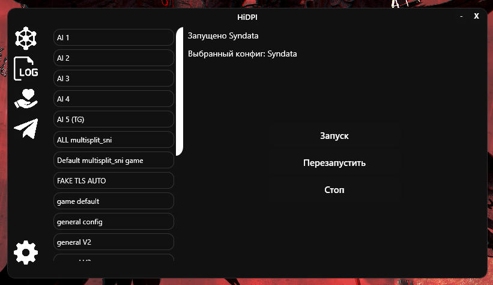
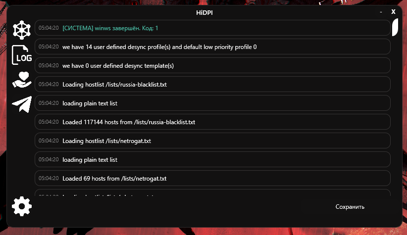
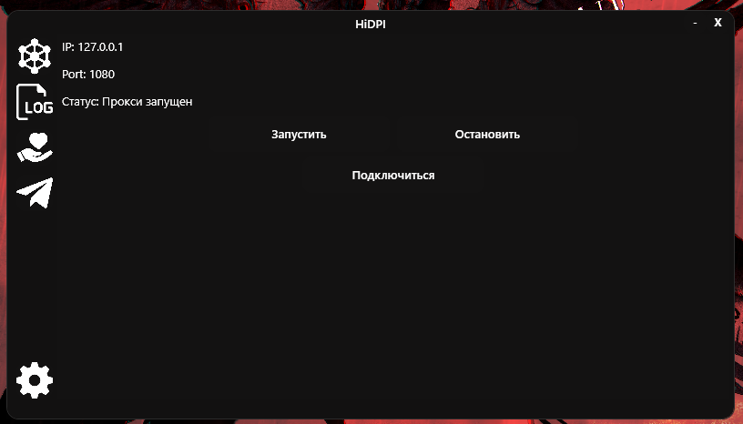
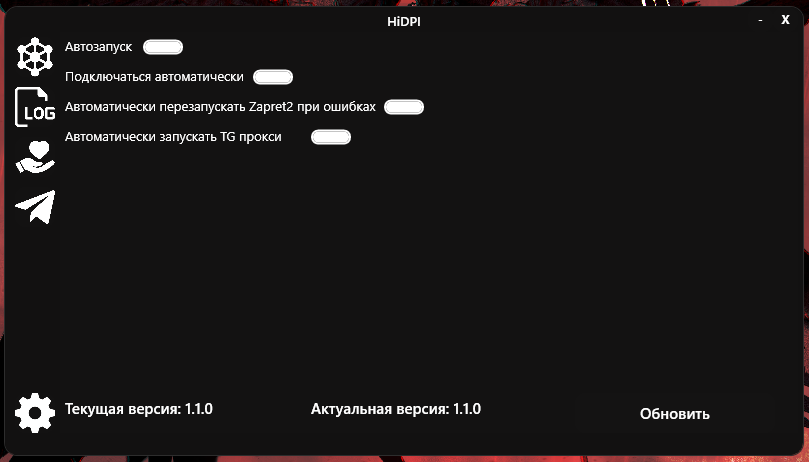

# HiDPI
Анти DPI с zapret2

# Функционал
-Автозапуск

-Автоподключение (Zapret/Telegram proxy)

-Обход Telegram Desktop

-Работа в фоновом режиме (нажмите на крестик, прога будет в трее)

# Скрины

Перезапускать HiDPI при изменении конфига- не нужно, всё происходит автоматически.

Достаточно открыть, изменить и сохранить сам конфиг.

Все конфиги находятся в папке configs.

**Для работы программы необходим [.NET 10](https://dotnet.microsoft.com/en-us/download/dotnet/10.0)**

# Ресурсы
## Движок
[Zapret2 BOL-VAN](https://github.com/bol-van/zapret2)
## Конфиги
[DISCORDYOUTUBE](https://github.com/youtubediscord/zapret2-youtube-discord/tree/main/presets)

*Переписаны с помощью нейронки
